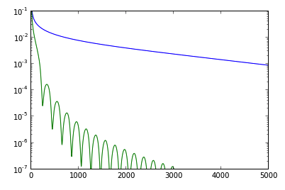

```{r setup, include=FALSE}
knitr::opts_chunk$set(echo = TRUE,fig.align = "center",fig.width = 10,fig.height = 8)
```

# Gradient Decent Methods

| Problem Formulation| $\min_{x\in R^n} f(x)$ |
| :---: | :--- |
| Function class |  Continuously Differentiable and bouded below $R^n$|
| Goal | Find local minimum $x^{*}$ |
| Scheme | Choose $x^0\in R^n$, and run $x^{k+1} = x^k - \alpha^k\nabla f(x^k)$ |

## Problem with additional assumptions

In many literatures, problems of interest are naturally endowed with some basic assumptions so that beautiful analytical results can be derived, such as the convergence rate. One might ask that why these assumptioms are important and what are intuitions behind these assumtions? We try to answer these questions in this section.

### Lipschtiz constant

Problems of interest are naturally endowed with the *Lipschitz continous gradient* property, that is 

```{definition}
We can $f(x)$ is gradient Lipschitz continous if  
$$||\nabla f(x) - \nabla f(y) || \leq L || x - y|| \forall x,y\in R^n.$$
Here $||.||$ means the Euclidean norm.
```

**Remark** Intuitively, the Lipschitz continous gradient property enforces $f(x)$ not to be “too sharp”. For example, the $f(x) = |x|$ dosen't enjoy this property.

**Remark** If $f(x)$ is gradient Lipschitz continous, then it is upper bounded by a quadratic function $\phi_1(x)$, that is

$$ f(x) \leq f(x_0) + \nabla f(x_0)^T(x-x_0) + \frac{L}{2} ||x-x_0||^2 := \phi_1(x) \quad \forall x,x_0\in R^n $$
also $f(x)$ is the upper bound of another quadratic function $\phi_2(x)$, taking form of 

$$ \phi_2(x) := f(x^0) + \nabla f(x_0)^T(x-x_0) - \frac{L}{2} ||x-x_0||^2. $$
See Figure\@ref(fig:geomlip) for example.

```{r geomlip, echo = F, fig.cap="An illustration of the gradient Lipschtiz continuous propety."}
knitr::include_graphics("pics/geomlip.png")
```

To verify this remark, we can apply the following lemma.

```{lemma, label="bound"}
If $f(x)$ is continuously differentiable and gradient Lipschtiz continuous, then for any $x,y$ the following holds:

$$ | f(x) - f(y) - (y-x)^T\nabla f(x)| \leq \frac{L}{2} || y-x ||^2$$
```

```{corollary}
From Lemma\@ref(lem:bound), we assert that if  $f(x)$ is continuously differentiable and gradient Lipschtiz continuous then the Hessian of $f(x)$ is bounded by $LI_n$, where $I_n$ is $n\times n$ unit matrix.

```


A easy way to check the *gradient Lipschitz continous* assumption is to apply the Lemma\@ref(lem:L-inclusion)[@nesterov2013introductory]

```{lemma, label="L-inclusion"}
If $f(x)$ is twice differentiable and satisfies $||\nabla f(x) - \nabla f(y) || \leq L || x - y||$ if and only if

$$ ||\nabla^2 f(x) || \leq L, \forall x\in R^n. $$

For matrix case, $||A|| = \sqrt{\lambda_{max}(A^TA)},\forall A\in R^{n\times n}.$
```

### Convexity

If $f(x)$ is convex, we enjoy the following nice property:

* The local minimum we find is also the global minimum;
* Using the First order optimality condition, we can dramatically simplify our problem. That is, we only have to construct a sequence $\{x^k\}$ that satifies $\lim_{k\rightarrow +\infty}||\nabla f(x^k)||=0$

### Strong Convexity 
We now only present a geometric interpretation of strong convexity and will go back to this point later when talking about the rate of convergence.

```{definition}
We can $f(x)$ is strongly convex if
$$ f(x) \geq f(x_0) + \nabla f(x_0)^T(x-x_0) + \frac{\ell}{2} ||x-x_0||^2  \forall x,x_0\in R^n $$

```

This means that we can squeeze a parabola between the tangent plane at $x_0$ given by the gradient and the function itself. Thus, the strong convexity assumption enforce the $f(x)$ not to be too "flat".

```{r geomstrong, echo = F, fig.cap="An illustration of the strongly convex propety."}
knitr::include_graphics("pics/geomstrong.png")
```

## Convex situations

Without additional assumptions, we can not guarantee convergence even to a local minimum and estimate the global performance of the proposed schemes. In general, the gradient method convergece only to a stationary point of $f(x)$. Therefore, from now on, we only focus on convex cases.

### step-size selection rule and the rate of convergence

The step-size $\alpha^k$ plays a key role in the convergence of the gradient descent method. If $\alpha^k$ is too small, more iterations will be required to achieve the $\epsilon$-accuracy ($|f(x^k)-f(x^*)|\leq \epsilon$). If $\alpha^k$ is too large, the scheme fails to converge. We here present two theoretical optimal step-size selection rules.

* If convex $f(x)$ is gradient Lipschtiz continuous, then the optimal $\alpha^k = \frac{1}{L}$.

* If strongly convex $f(x)$ is gradient Lipschtiz continuous, then the optimal $\alpha^k = \frac{2}{L+\ell}$.

Here, *optimal* means 

$$
\alpha^k = \mathop{\text{argmin}}_{\alpha} f(x^k - \alpha\nabla f(x^k)).
$$
It has been proved that 

* For convex and gradient Lipschtiz continuous $f(x)$, with chosen step-size $\alpha^k = \frac{1}{L}$ , the rate of convergence is sub-linear. To be specific, 

  $$f(x_k) - f(x^*) \leq \frac{2L||x^0 - x^*||^2}{k+4}.$$
  
* For strongly convex and gradient Lipschtiz continuous $f(x)$, with chosen step-size $\alpha^k = \frac{2}{L + \ell}$ , the rate of convergence is linear. To be specific,

  $$f(x_k) - f(x^*) \leq \frac{L}{2}\big(\frac{L-\ell}{L+\ell}\big)^{2k}||x^0 - x^*||^2.$$
Technically, the above results are mainly derived from two steps:

*  Find how much you can improve in a single interation by establishing

$$f(x^{k+1}) \leq  f(x^k) - \omega_1 ||\nabla f(x_k)|| $$

* Find how far at most we still need to go to recach the minimum by establishing

$$f(x^k) - f(x^*) \leq \omega_2||\nabla f(x_k)||$$

### Why linear rate of convergence? 

Before we answer this question, we first list the definition of a contraction mapping and the Banach fixed-point theorem.

```{definition, name="Contraction Mapping"}
Let $(X, d)$ be a metric space. Then a map $T : X \rightarrow X$ is called a contraction mapping on $X$ if there exists $q \in [0, 1)$ such that

$$ d(T(x),T(y))\leq qd(x,y) \forall x, y \in X.$$

```

```{theorem, name="Banach Fixed Point Theorem"}
Let $(X, d)$ be a non-empty complete metric space with a contraction mapping $T : X \rightarrow X$. Then $T$ admits a unique fixed-point $x^*$ in $X$ (i.e. $T(x^*) = x^*$). Furthermore, $x^*$ can be found as follows: start with an arbitrary element $x_0$ in $X$ and define a sequence $\{x_n\}$ by $x_n = T(x_{n−1})$, then $x_n \rightarrow x^*$. Moreover,
$$ d(x^{*},x_{n+1})\leq qd(x^{*},x_{n}) $$
```

Then we establish connections between contraction mapping and linear rate of convergence through the gradient decent method, which takes the form of 

$$x^{k+1} = x^k - \alpha\nabla f(x^k),$$
If we  define a mapping as $g(x) = x - \alpha\nabla f(x)$ and suppose $g(x)$ is contractive on $R^n$. Assume there exists a stationary point $x^*$, then starting from any point $x^0$, we derive

$$
\begin{align}
||x^{k+1} - x^*|| &= ||x^{k} - \alpha\nabla f(x^k) - x^*|| \\
                  &= || g(x^k) - g(x^*)|| \\
                  & \leq q||x^k - x^*|| \\
                  & \leq q^{k+1}|| x^0 - x^* || (\#eq:linear)
\end{align}
$$
\@ref(eq:linear) indicates that the rate of convergence is linear.

Finally, we assert that 

```{lemma}
If $f(x)$ is twice continuously differentiable, the $g(x)$ is a contraction mapping if and only if $f(x)$ is strongly convex on $R^n$.
```


```{proof}
Suppose $g(x)$ is contractivie, then we derive,
\begin{align}

\lim_{t\rightarrow 0^+} \frac{1}{t} || g(x + t\Delta x) - g(x) || 
&=  \lim_{t\rightarrow 0^+}  || \Delta x - \frac{\alpha}{t}[\nabla f(x + t\Delta x) - \nabla f(x)] || \\
&= || \Delta x - \alpha \nabla^2 f(x)\Delta x || \\
& \leq q||\Delta x|| (\#eq:convex)

\end{align}

\@ref(eq:convex) holds by the contractivity and it means that $||I_n - \alpha\nabla^2 f(x)||\leq q$. Therefore, we derive

$$ \frac{1-q}{\alpha}I_n  \leq \nabla^2 f(x) \leq \frac{1+q}{\alpha} I_n $$. Therefore $f(x)$ is strongly convex.

Suppose $f(x)$ is strongly convex, go backward of the above proof, we assert $g(x)$ is contractive.
```

\

We close this subsection by pointing out that the scheme discussed above are not optimal. Here the *optimal* is in terms of the lower complexity bound. In [@nesterov2013introductory], Nesterov proves the following two theorems. 

**Assumption LC**  An interative method generates a sequence of test points $\{x^k\}$ such that $x^k \in x^0 + \sum_{i=1}^{k-1} a^i\nabla f(x^{i})$.

```{theorem, label="slow"}
For any $k$, $1 \leq k \leq \frac{1}{2} (n-1)$, and any $x_0\in R^n$, there exists a continuous differentiable and gradient Lipschitz continuous convex function $f(x)$ such that for any first order method satisfying the Assumption LC, we have 

$$ f(x_k) - f^* \geq \frac{3L||x^0 - x^*||^2}{32(k+1)^2}$$
$$ ||x^k - x^*|| \geq \frac{1}{32} || x^0 - x^* ||^2,$$

where $L$ is the gradient Lipschitz continuous parameter.
```

```{theorem, label="llow"}
For any $x_0\in R^n$ and constant $\ell>0,L>1$, there exists a continuous differentiable strongly convex function $f(x)$ such that for any first order method satisfying Assumption LC, we have 

$$ f(x_k) - f^* \geq \frac{\ell}{2}(\frac{\sqrt{L/\ell}-1}{\sqrt{L/\ell}+1})^{2k}|| x^0 - x^* ||^2$$
$$ ||x^k - x^*||^2 \geq (\frac{\sqrt{L/\ell}-1}{\sqrt{L/\ell}+1})^{2k} || x^0 - x^* ||^2,$$

where $L$ and $\ell$ are the gradient Lipschitz continuous parameter and strongly convex parameter.
```
\
Theorem \@ref(thm:slow) and Theorem \@ref(thm:llow) leaves room for our next section's topic - acceleartion.

## Acceleartion

### Motivation for acceleration.

Apart from what we mentioned above the lower complexity bound, we note that even we can obtain linear rate of convergence, gradient descent method can still be dreadfully slow in practice. Let's look at the example below.

```{example, label="plaingd"}
If $f(x) = \frac{1}{2} x^TAx$, where $A = \begin{pmatrix}200 & 0 \\ 0 & 1 \end{pmatrix}$. And we run gradient descent method with starting point $x^0 = (0.1,0.1)$ and step-size $\alpha = \frac{2}{201}$. If we run gradient descent method 100 times, we will get following results.
```

```{r contour_g,echo=FALSE}
gd <- function(x0,lipschtiz,strongconvex,iterations){
  A = cbind(c(lipschtiz,0),c(0,strongconvex))
  x_seq = matrix(ncol=(iterations+1), nrow=2)
  fval_seq = rep(0,iterations+1)
  x_seq[,1] = x0
  fval_seq[1] = 0.5 * ( t(x0) %*% A %*% x0)
  for (i in seq_len(iterations)){
    x_seq[,i+1] = x_seq[,i] - (2 / (lipschtiz + strongconvex)) * ( A %*%  x_seq[,i])
    fval_seq[i+1] =  0.5 * ( t(x_seq[,i+1]) %*% A %*% x_seq[,i+1])
  }
  # for contour plot
  x1 <- seq(-(1.1*x0[1,]),(1.1*x0[2,]),length.out = 100)
  x2 <- seq(-(1.1*x0[1,]),(1.1*x0[2,]),length.out = 100)
  z <- matrix(ncol=100,nrow=100)
  for (i in seq_len(100)){
    for (j in seq_len(100)){
      x <- c(x1[i],x2[j])
      z[i,j] <- 0.5 * t(x) %*% A %*% x
    }
  }
  results = list (fval_seq = fval_seq, x_seq = x_seq, x1=x1, x2=x2, z=z)
  return (results)
}
x0 = matrix(c(0.1,0.1),nrow=2)
results = gd(x0,lipschtiz=200,strongconvex=1,iterations=100)
# par(mfrow = c(1,2))
contour(x = results$x1, y = results$x2,z = results$z, 
        nlev = 50, lty = 2, method = "simple",
        drawlabels = F,axes = TRUE,
        xlab=expression(x[1]),ylab=expression(x[2]))
lines(x=results$x_seq[1,],y=results$x_seq[2,],col="blue",pch=1)
points(x=results$x_seq[1,],y=results$x_seq[2,],col="blue",pch=1)
points(x=0,y=0,col="red")
```

Figure above shows that the path of iterates is zig-zag, hence converging slowly to the global optimal solution $(0,0)$. The reason lies in the condition number $\kappa = L/\ell$, which is too large. And in
$$f(x_k) - f(x^*) \leq \frac{L}{2}\big(\frac{L-\ell}{L+\ell}\big)^{2k}||x^0 - x^*||^2.$$
the shrinkage factor $\frac{L-\ell}{L+\ell}$ is close to $1$, which means, you can gain little improvement in each iteration.

Intuitively, to get around this situation, we have to avoid "oscillation" phenomenon. One commonly used strategy is to the previous stage's direction $x^{k-1}-x^k$ to modify the current direction $\nabla f(x^k)$. We go along the composite direction $\xi^k (x^{k-1}-x^k)  + \zeta^k\nabla f(x^{k})$ to find the $x^{k+1}$.

### Why we can accelerate? 

Take the folowing example to illustrate.

```{example}
Consider using gradient descent methods to solve the problem shown below.

$$\mathop{\text{agrmin}}_{x\in R^n} \frac{1}{2}x^TAx - b^Tx$$

where $\ell I_n \leq A \leq L I_n$. All that gradient descent does is to compute the sequence of points 

$$ x^{k+1} = x^k - t^k \nabla f(x^k) $$.

Let's set $t^k = t= 2/(\ell + L)$ and run gradient descent with starting points $x^0 = tb$. We can then check that

$$ x^k = \Big(\sum_{j=0}^k (I-A')^k\Big)b' $$ 

where $A′=tA$ and $b′=tb$. Since $||A'||<1$, $x^k \rightarrow x^* = A^{-1}b$. This is the generlization of following result
$$\frac{1}{x} = \sum_{k=0}^\infty (1-x)^k, \forall |x|<1 .$$

Moreover, the approximation error when truncating the series at degree $k$ is $O( (1-x)^k)).$

So to improve on gradient descent it suffices to find a better low-degree approximation to the scalar function $1/x$. Indeed, we can save a square root in the degree while achieving the same error by using [Chebyshev polynomials](https://en.wikipedia.org/wiki/Chebyshev_polynomials). Chebyshev polynomials of the first kind takes the form of

$$
\begin{aligned}
T_{0}(x)&=1\\
T_{1}(x)&=x\\
T_{n+1}(x)&=2xT_{n}(x)-T_{n-1}(x).
\end{aligned}
$$

The Chebyshev polynomials satisfy a simple recursive definition that defines the k-th degree polynomial in terms of the previous two polynomials. This means that accelerated gradient descent only needs the previous two gradients with suitable coefficients:

$$ x_k = x_{k-1} - \alpha_k \nabla f(x_{k-1}) + \beta_k \nabla f(x_{k-2}). $$
This conicides with the general form Nesterov Accelerated Gradient Descent Method(NAGD). Detailed discussion can be found [here](http://blog.mrtz.org/2013/09/07/the-zen-of-gradient-descent.html).
```

### Heavy Ball Methods v.s NAGD Method

Let's put our intuition into concrete mathematical form, which gives rise to the Heavy Ball Method.


| Name |  Heavy Ball Methods|  
| --- | --- |
|  Scheme| Set $x^0 \in R^n$, and run $x^{k+1} = x^k - [\alpha\nabla f(x^k) + \beta (x^{k-1} - x^k)]$  | 

What Nesterov does is mcuh more "smart". To be specific, instead of using current iterate's gradient information, $\nabla f(x^k)$, Nesterov suggests using the approximate position of $x^{k+1}$, given by $x^k  + \gamma^{k-1}(x^{k-1} - x^k)$.


| Name |  NAGD Methods|  
| --- | --- |
|  Scheme| Set $x^0 \in R^n$, and run $x^{k+1} = x^k  - \frac{1}{L}\nabla f[x^k  + \gamma^{k-1}(x^{k-1} - x^k)] + \gamma^{k-1}(x^{k-1} - x^k)$ |

The NAGD Methods can be also seen as a two stage iterative methods, by re-constructing $x^{k+1} = x^k  - \frac{1}{L}\nabla f[x^k  + \gamma^{k-1}(x^{k-1} - x^k)] + \gamma^{k-1}(x^{k-1} - x^k)$  as

$$
\begin{cases}
  y^{k+1} &= x^k - \alpha f(x^k)\; &[1]\\
  x^{k+1} &= (1 - \gamma^k)y^{k+1} + \gamma^k y^k\; &[2]
\end{cases}
$$

* [1] performs a simple step of gradient descent to go from $x^k$ to $y^{k+1}$ and then,
* [2] slides a little bit further than $y^{k+1}$ in the direction given by the previous iterate $y^k$.

**Remark: Parameter Selection.** 
The $\alpha,\beta,\gamma^k$ is given as follows to guarantee convergence.

$$
\begin{align}
& \alpha = \frac{4}{L}\frac{1}{(1 + \frac{1}{\sqrt{L/\ell}})^2} \\
& \beta = (1 - \frac{2}{\sqrt{L/\ell}+1})^2 \\
& \gamma^k = \frac{1-\lambda^k}{\lambda^k + 1}
\end{align}
$$
where $\lambda^0=0, \lambda^k = \frac{1+ \sqrt{1 + 4(\lambda^{k-1})^2}}{2}$.

We conclude this section by performing two methods on the problem of Example\@ref(ex:plaingd).

```{r HB,echo=FALSE}
hb <- function(x0,lipschtiz,strongconvex,iterations){
  A = cbind(c(lipschtiz,0),c(0,strongconvex))
  x_seq = matrix(ncol=(iterations+1), nrow=2)
  fval_seq = rep(0,iterations+1)
  x_seq[,1] = x0
  x_seq[,2] = x0
  fval_seq[1] = 0.5 * ( t(x0) %*% A %*% x0)
  fval_seq[2] = 0.5 * ( t(x0) %*% A %*% x0)
  alpha = 4 / (sqrt(lipschtiz) + sqrt(strongconvex))^2
  beta = ( 1 - 2 / ( sqrt(lipschtiz/strongconvex) + 1) )^2
  for (i in 2:iterations){
    x_seq[,i+1] = x_seq[,i] - alpha * A %*% x_seq[,i] + beta * (x_seq[,i] - x_seq[,i-1])
    fval_seq[i+1] =  0.5 * ( t(x_seq[,i+1]) %*% A %*% x_seq[,i+1]) 
  }
  # for contour plot
  x1 <- seq(-(1.1*x0[1,]),(1.1*x0[2,]),length.out = 100)
  x2 <- seq(-(1.1*x0[1,]),(1.1*x0[2,]),length.out = 100)
  z <- matrix(ncol=100,nrow=100)
  for (i in seq_len(100)){
    for (j in seq_len(100)){
      x <- c(x1[i],x2[j])
      z[i,j] <- 0.5 * t(x) %*% A %*% x
    }
  }
  results = list (fval_seq = fval_seq, x_seq = x_seq, x1=x1, x2=x2, z=z)
  return (results)
}
x0 = matrix(c(0.1,0.1),nrow=2)
results_hb = hb(x0,lipschtiz=200,strongconvex=1,iterations=100)
contour(x = results_hb$x1, y = results_hb$x2,z = results_hb$z, 
        nlev = 50, lty = 2, method = "simple",
        drawlabels = F,axes = TRUE,
        xlab=expression(x[1]),ylab=expression(x[2]))
lines(x=results_hb$x_seq[1,],y=results_hb$x_seq[2,],col="blue",pch=1)
points(x=results_hb$x_seq[1,],y=results_hb$x_seq[2,],col="blue",pch=1)
points(x=0,y=0,col="red")
```
```{r NAGD,echo=FALSE}
nagd <- function(x0,lipschtiz,strongconvex,iterations){
  A = cbind(c(lipschtiz,0),c(0,strongconvex))
  x_seq = matrix(ncol=(iterations+1), nrow=2)
  fval_seq = rep(0,iterations+1)
  x_seq[,1] = x0
  fval_seq[1] = 0.5 * ( t(x0) %*% A %*% x0)
  lambda = 0
  y = x_seq[,1]
  for (i in 1:iterations){
    lambda = 0.5 * (1 + sqrt(1+4*lambda^2))
    lambda_new = 0.5 * (1 + sqrt(1+4*lambda^2))
    gamma = (1 - lambda) / lambda_new
    y_new = x_seq[,i] - (1 / lipschtiz) * A %*% x_seq[,i]
    x_seq[,i+1] = (1 - gamma) * y_new + gamma * y
    y = y_new
    fval_seq[i+1] =  0.5 * ( t(x_seq[,i+1]) %*% A %*% x_seq[,i+1]) 
  }
  # for contour plot
  x1 <- seq(-(1.1*x0[1,]),(1.1*x0[2,]),length.out = 100)
  x2 <- seq(-(1.1*x0[1,]),(1.1*x0[2,]),length.out = 100)
  z <- matrix(ncol=100,nrow=100)
  for (i in seq_len(100)){
    for (j in seq_len(100)){
      x <- c(x1[i],x2[j])
      z[i,j] <- 0.5 * t(x) %*% A %*% x
    }
  }
  results = list (fval_seq = fval_seq, x_seq = x_seq, x1=x1, x2=x2, z=z)
  return (results)
}
x0 = matrix(c(0.1,0.1),nrow=2)
results_nagd = nagd(x0,lipschtiz=200,strongconvex=1,iterations=100)
contour(x = results_nagd$x1, y = results_nagd$x2,z = results_nagd$z, 
        nlev = 50, lty = 2, method = "simple",
        drawlabels = F,axes = TRUE,
        xlab=expression(x[1]),ylab=expression(x[2]))
lines(x=results_nagd$x_seq[1,],y=results_nagd$x_seq[2,],col="blue",pch=1)
points(x=results_nagd$x_seq[1,],y=results_nagd$x_seq[2,],col="blue",pch=1)
points(x=0,y=0,col="red")
```

```{r,echo=FALSE}
plot(results$fval_seq,type="l",col="red",lty=1,
     ylim = c(0,2),xlab = "iterations",ylab = "error")
lines(results_hb$fval_seq,type="l",col="blue",lty=2)
lines(results_nagd$fval_seq,type="l",col="black",lty=3)
leg.1 <- c("Gradient Descent")
leg.2 <- c("Heavy Ball")
leg.3 <- c("NAGD")
legend("topright",legend = c(leg.1,leg.2,leg.3),
       col=c("red","blue","black"),border = "red",
       bty = "o",lty=c(1,2,3))
```

**Remark** NAGD dose not guranteen the generated $f(x^k)$ is non-increasing. For example, in Moritz Hardt's [post](http://blog.mrtz.org/2014/08/18/robustness-versus-acceleration.html), an example was given.

```{r non-increasing, echo=FALSE, fig.cap="Oscillation in the function value sequence. The blue line represents the gradient method while the green one stands for NAGD method. "}

```


### When does the NAGD Methods fail?

The NAGD can not be a panacea in the optimization. Believe it or not, even the gradient method can beat it in some situations. For example,  Moritz Hardt points out in his [post](http://blog.mrtz.org/2014/08/18/robustness-versus-acceleration.html) that situation changes dramatically in the presence of noise. To be specific, instead of observing $\nabla f(x)$ for any given x, we can only see  $\nabla f(x) + \epsilon$, where $\epsilon \sim N(0,\sigma^2 I_n)$.

```{r, echo=FALSE}
nagd_noise <- function(x0,lipschtiz,strongconvex,iterations){
  A = cbind(c(lipschtiz,0),c(0,strongconvex))
  x_seq = matrix(ncol=(iterations+1), nrow=2)
  fval_seq = rep(0,iterations+1)
  x_seq[,1] = x0
  fval_seq[1] = 0.5 * ( t(x0) %*% A %*% x0)
  lambda = 0
  y = x_seq[,1]
  for (i in 1:iterations){
    lambda = 0.5 * (1 + sqrt(1+4*lambda^2))
    lambda_new = 0.5 * (1 + sqrt(1+4*lambda^2))
    gamma = (1 - lambda) / lambda_new
    set.seed(i+1)
    noise = matrix(rnorm(2,mean=0,sd=2),nrow=2)
    y_new = x_seq[,i] - (1 / lipschtiz) * ( A %*% x_seq[,i] + noise)
    x_seq[,i+1] = (1 - gamma) * y_new + gamma * y
    y = y_new
    fval_seq[i+1] =  0.5 * ( t(x_seq[,i+1]) %*% A %*% x_seq[,i+1]) 
  }
  # for contour plot
  x1 <- seq(-(1.1*x0[1,]),(1.1*x0[2,]),length.out = 100)
  x2 <- seq(-(1.1*x0[1,]),(1.1*x0[2,]),length.out = 100)
  z <- matrix(ncol=100,nrow=100)
  for (i in seq_len(100)){
    for (j in seq_len(100)){
      x <- c(x1[i],x2[j])
      z[i,j] <- 0.5 * t(x) %*% A %*% x
    }
  }
  results = list (fval_seq = fval_seq, x_seq = x_seq, x1=x1, x2=x2, z=z)
  return (results)
}
gd_noise <- function(x0,lipschtiz,strongconvex,iterations){
  A = cbind(c(lipschtiz,0),c(0,strongconvex))
  x_seq = matrix(ncol=(iterations+1), nrow=2)
  fval_seq = rep(0,iterations+1)
  x_seq[,1] = x0
  fval_seq[1] = 0.5 * ( t(x0) %*% A %*% x0)
  for (i in seq_len(iterations)){
    set.seed(i+1)
    noise = matrix(rnorm(2,mean=0,sd=2),nrow=2)
    x_seq[,i+1] = x_seq[,i] - (2 / (lipschtiz + strongconvex)) * 
      ( A %*%  x_seq[,i] + noise)
    fval_seq[i+1] =  0.5 * ( t(x_seq[,i+1]) %*% A %*% x_seq[,i+1])
  }
  # for contour plot
  x1 <- seq(-(1.1*x0[1,]),(1.1*x0[2,]),length.out = 100)
  x2 <- seq(-(1.1*x0[1,]),(1.1*x0[2,]),length.out = 100)
  z <- matrix(ncol=100,nrow=100)
  for (i in seq_len(100)){
    for (j in seq_len(100)){
      x <- c(x1[i],x2[j])
      z[i,j] <- 0.5 * t(x) %*% A %*% x
    }
  }
  results = list (fval_seq = fval_seq, x_seq = x_seq, x1=x1, x2=x2, z=z)
  return (results)
}
x0 = matrix(c(0.1,0.1),nrow=2)
results_diverge_nagd = nagd_noise(x0,lipschtiz=200,strongconvex=1,iterations=30)
results_converge_gd = gd_noise(x0,lipschtiz=200,strongconvex=1,iterations=30)
plot(results_diverge_nagd$fval_seq,type="l",col="red",lty=1,xlab = "iterations",ylab = "error")
lines(results_converge_gd$fval_seq,type="l",col="blue",lty=2)
leg11 <- c("Gradient Descent")
leg22 <- c("NAGD")
legend("topright",legend = c(leg11,leg22),
       col=c("red","blue"),border = "red",
       bty = "o",lty=c(1,2))
```

A more concrete example can be found [here](http://nbviewer.jupyter.org/gist/mrtzh/4dc77fb84c3ba8b8b220)


```{r robust, echo=FALSE, fig.cap="Robustness comparison. The blue line represents the gradient method while the green one stands for NAGD method. "}
knitr::include_graphics("pics/robust.png")
```

Figure\@ref(fig:robust) shows that gradient descent method pretty quickly converges to essentially the best result that we can hope for given the noisy gradients. In contrast, NAGD goes doesn't converge at all and it adds up errors in sort of linear fashion. In this world, gradient descent is the clear winner.