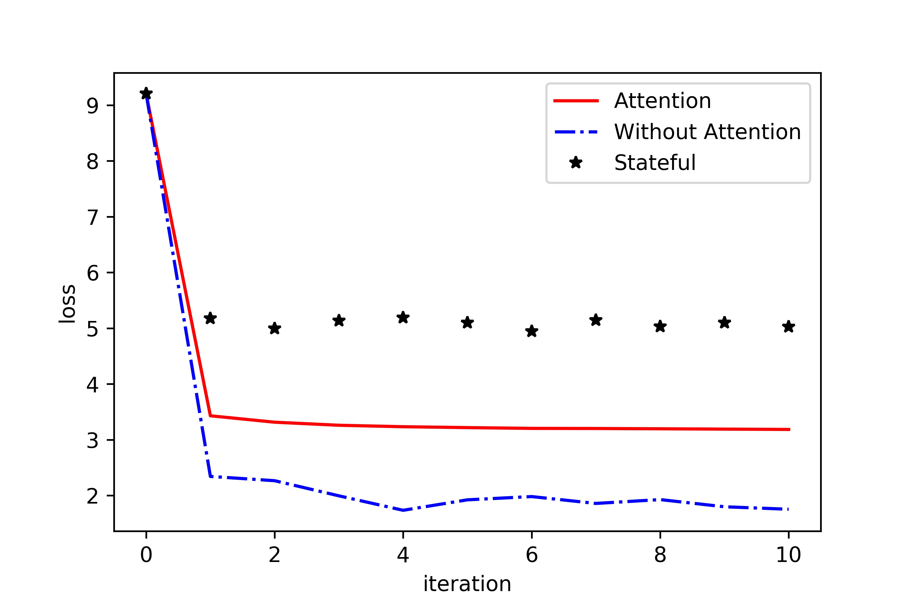
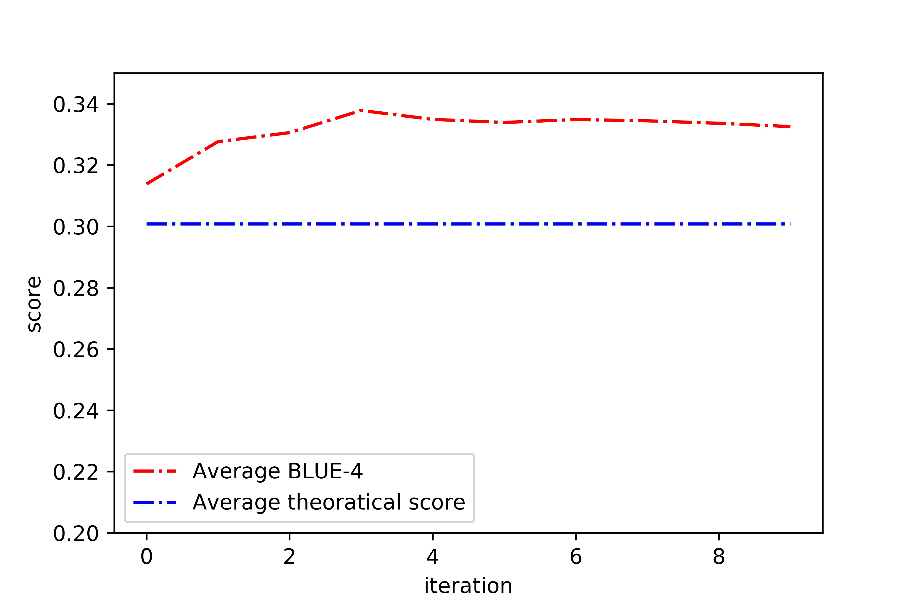
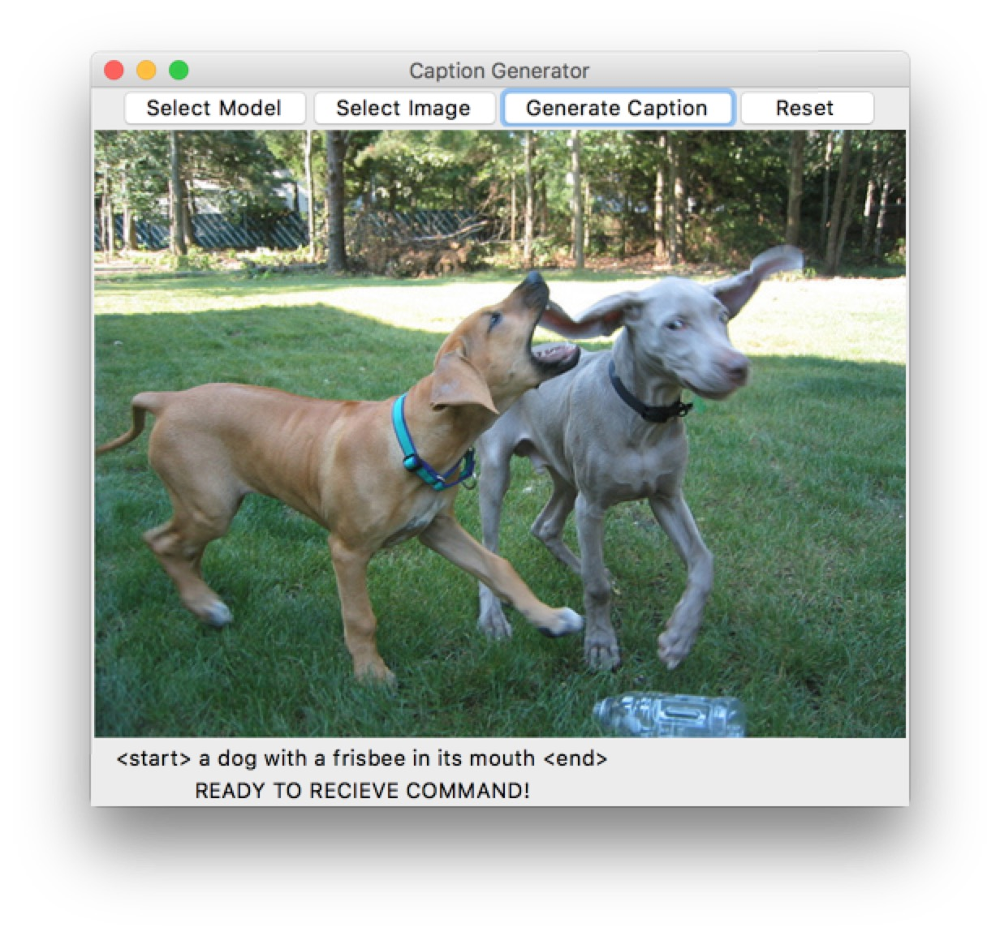
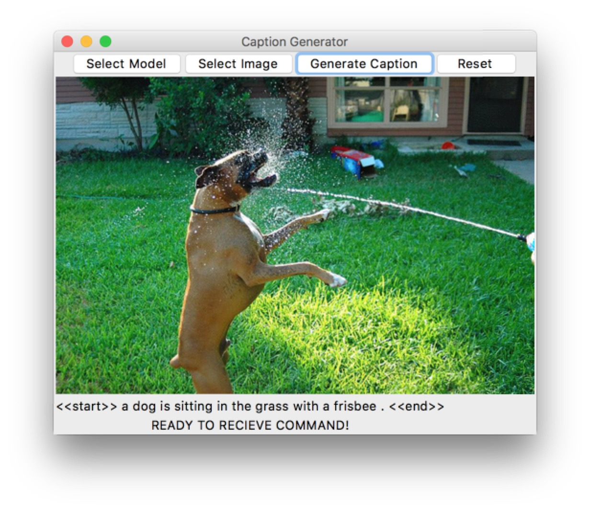

In the area of artificial intelligence, automatically describing the content on an image using properly formed English sentences is a challenging task. Leveraging the advances in recognition of objects allows us to drive natural language generation systems, but the current approaches have limited ability in their expressivity. Most closely, neural networks are used to co-embed images and sentences together, but they didn't attempt to generate novel descriptions. For this paper, the authors combined deep convolutional nets for image classification with recurrent networks for sequence modeling to create a single end-to-end network that generates descriptions of images. They take the image $I$ as input and produced a target sequence of words $S = \{S_1, S_2, \ldots\}$ by directly maximizing the likelihood $p(S|I)$. They used a deep convolution neural network as an encoder function to produce a rich representation of the input image by embedding it to a fixed-length vector. This embedding vector will be used as the initial hidden state of a decoder recurrent network that will be used to generated the target sentence. They present an end-to-end system for this sentence caption generation problem. Their neural network is trainable using stochastic gradient descent and also combines the current state-of-art sub-networks for image and language models. These sub-models could be pre-trained on larger datasets and take advantage of additional data. Finally, through experiment results, they show their method could perform significantly better compared with the current state-of-art approaches.

This is a project report for reproducing and improving the methods proposed in the paper [Show and Tell: A Neural Image Caption Generator](https://arxiv.org/abs/1411.4555).

## Documentation

Please [read this report for details](report/Final_report.pdf).

## Results

## UI
A UI is provided to generate caption. *Python 3* and *pytorch 0.4* are required to run the UI. You can

Several examples are provided below.

**without attention**

**with attention**

**We directly use the code from this [repo](https://github.com/sgrvinod/a-PyTorch-Tutorial-to-Image-Captioning)** to train the model with attention mechanism.
